# Nepali Embossed Number Plate Detection 

This project detects **Nepali embossed vehicle number plates** from **images** and **videos**,  
performs **character segmentation**, and recognizes the license plate using **YOLOv8 + EasyOCR**.

It also saves the cropped plates, segmented characters, and detection results for further processing.

---

## 📂 Project Structure
    nepali_embossed_number_plate_detection/
    │
    ├── models/ # YOLO models
    │ ├── best.pt # YOLO model for license plates
    │ ├── yolov8l.pt # YOLO model for vehicle detection
    │
    ├── images/ # Sample images and videos
    │ ├── for_image # Sample output
    │ ├── for_video # Sample output
    │ 
    ├── resources/ # Sample images and videos
    │ ├── IMG_2116.JPG # Sample input image
    │ ├── first.mp4 # Sample video
    
    ├── docs/ # YOLO models
    │ ├── ARV.docs # documentation for project
    │
    ├── util.py # Helper functions (formatting, CSV writing, contour grouping)
    ├── detect_image.py # Script to detect plates from an image
    ├── detect_video.py # Script to detect plates from a video
    ├── requirements.txt # Python dependencies
    |── results.csv # to view the reuslts for the detect_video
    └── README.md # This file


---

## ⚙️ Installation

1. Clone the repo:
    ```bash
    git clone https://github.com/aashish/nepali_embossed_number_plate_detection.git
    cd nepali_embossed_number_plate_detection

2. Install dependencies:
   ```bash
   pip install -r requirements.txt

3. Install Git LFS to handle large YOLO models:
   ```bash
   git lfs install

1. Detect from image:
   ```bash
   python detect_image.py

2. Detect from video:
   ```bash
   python detect_video.py

### 📄 Project Report
You can view the full project report [here](./docs/ARV.docx).

### Dataset
The full training images with labesls can be downloaded from Google Drive:  
[Download here](https://drive.google.com/file/d/1saP-M1m2jGIipcdtLUqupTHuyXWUJsAz/view?usp=sharing)

   
Sample Outputs

🔹 Input Example

Here is a sample input image:

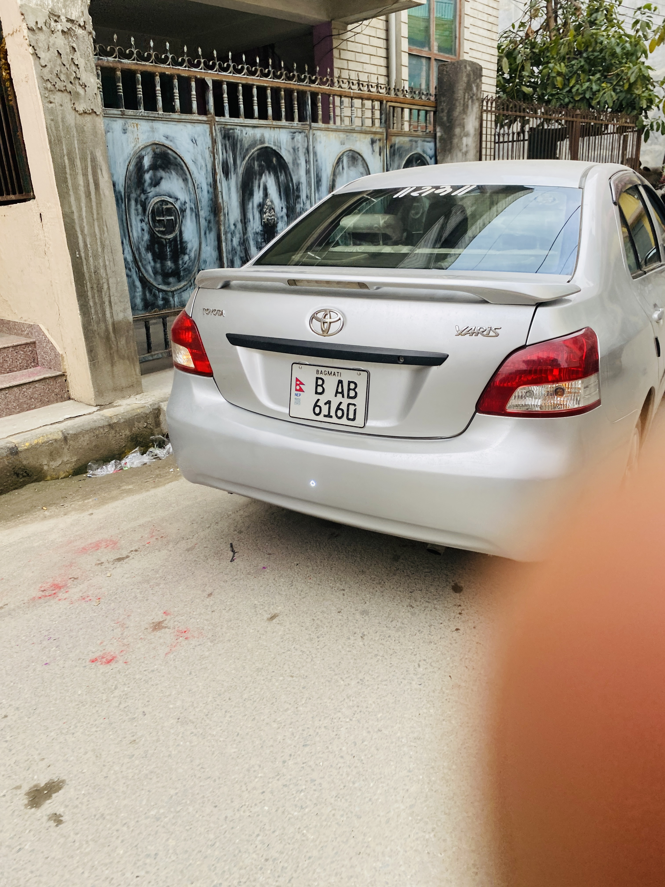
🔹 Detected Characters from Photo

Below are the segmented characters detected from an image:

<p float="left"> 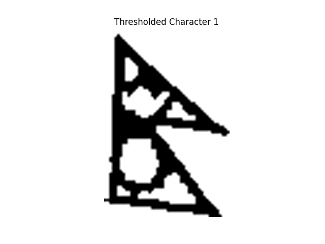 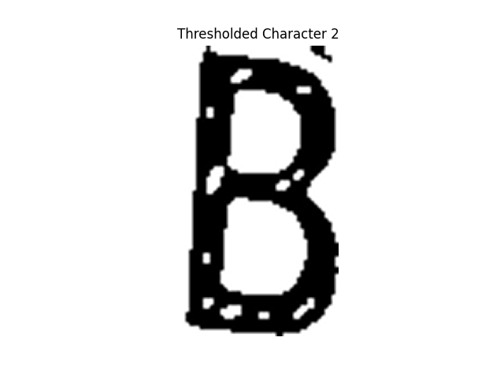 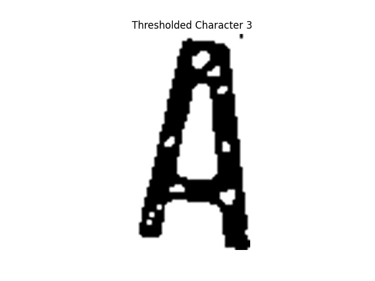 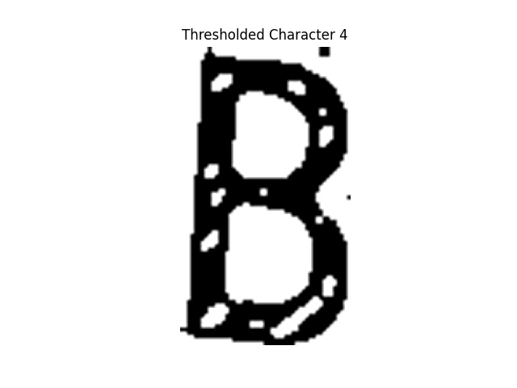 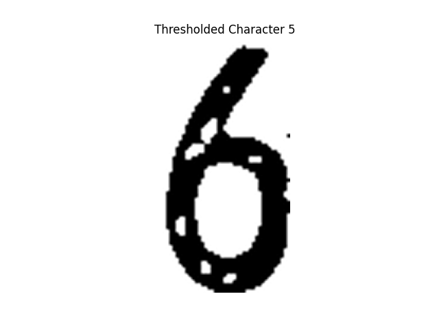 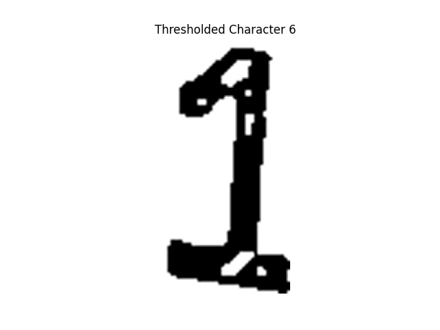 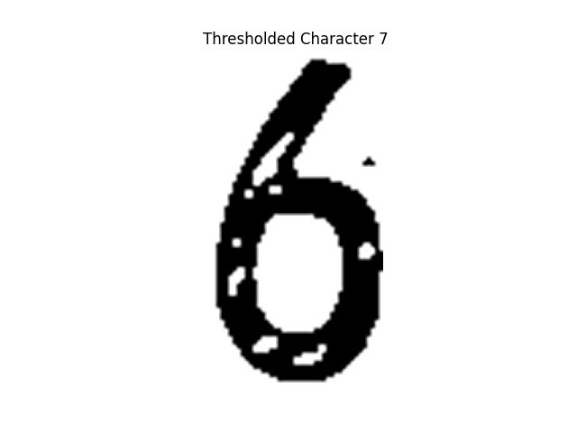 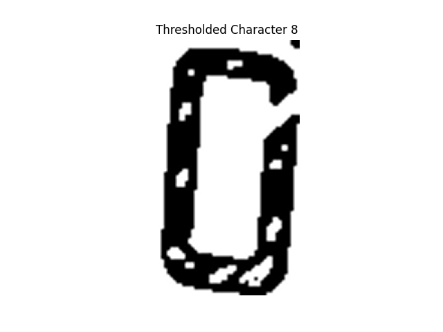 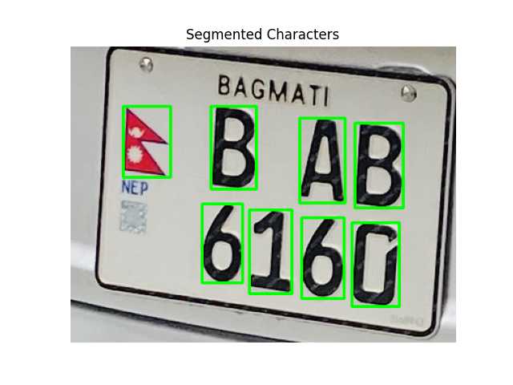 </p>


### 🎥 Sample Video Output

Here is a sample video :

[](resources/first.mp4)

Here are some of the result detected for the video frame:

<p float="left"> 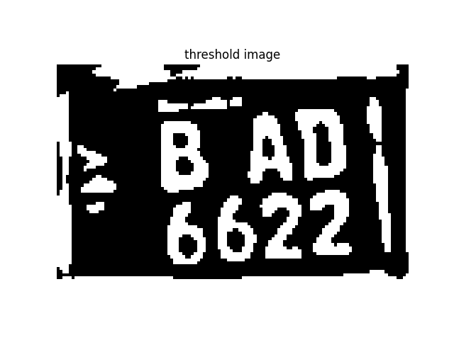 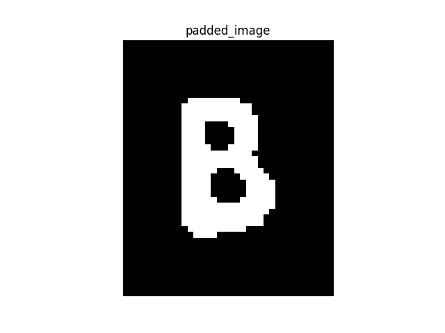 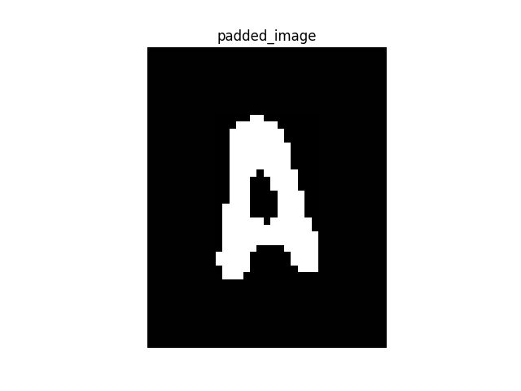 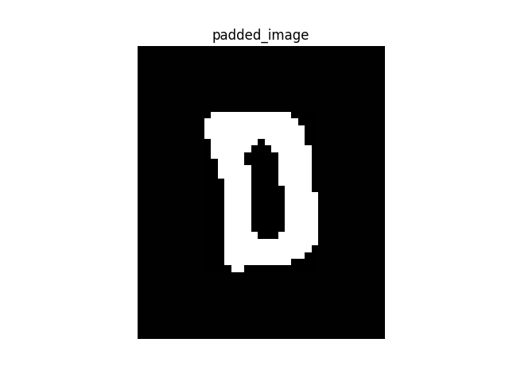 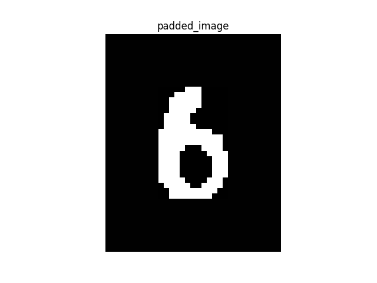 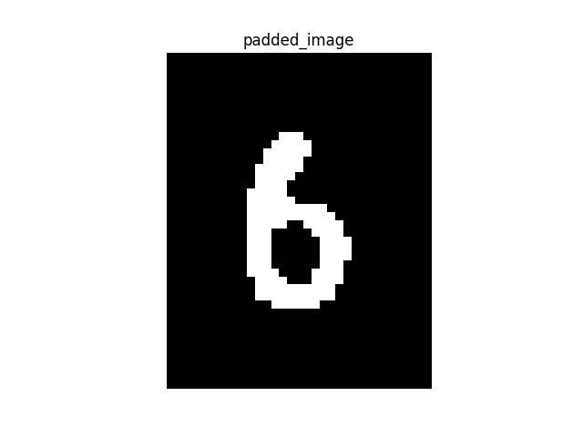 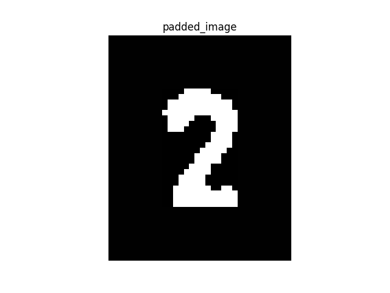 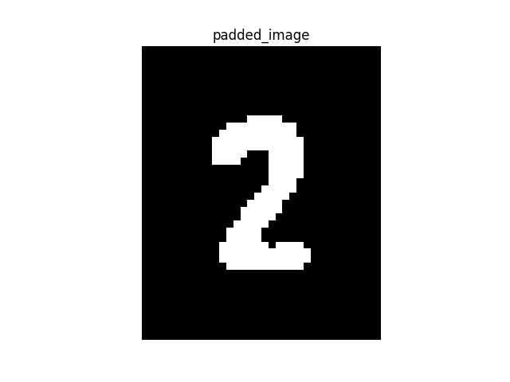 </p></p></p>  

## Features

- Detects vehicles and number plates in images & videos
- Crops license plates and segments characters
- Recognizes plate numbers with confidence scores
- Saves results in CSV for further analysis
- Visualizes segmented characters for debugging


## Notes

- YOLO models (best.pt, yolov8l.pt) are tracked with Git LFS.
- Make sure to install Git LFS before cloning.
- Sample images and videos are included for testing

##  Project Info

This project was built by:

- **Aashish Roka**  
- **Reeya Mishra**  
- **Vagwat kumar shah**  

## Disclaimer
This project is developed solely for **research and educational purposes**.  
It may contain bugs or limitations, and the current implementation may not work well on all types of images, especially under diverse conditions (e.g., different lighting, angles, or occlusions).  

Use at your own risk — contributions and improvements are welcome!


